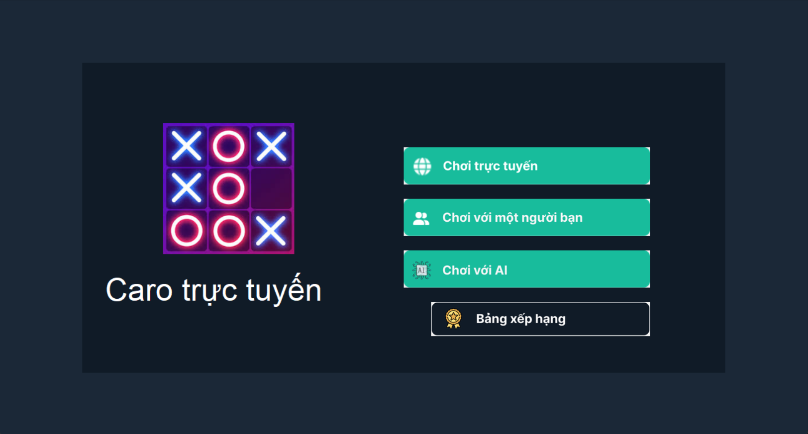
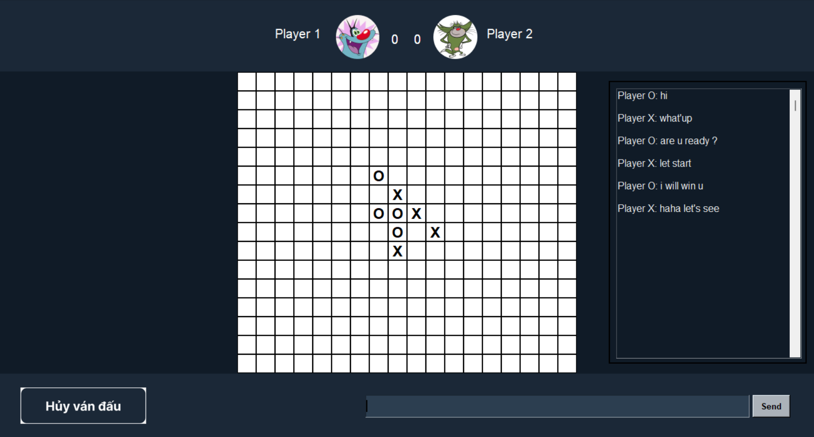

<!-- Improved compatibility of back to top link: See: https://github.com/othneildrew/Best-README-Template/pull/73 -->
<a name="readme-top"></a>


<!-- ABOUT THE PROJECT -->
## About The Project
### Gomoku game
Gomoku is an ancient strategy game also known as "five points in a row". The game is very simple even in the rules and format so it should be played by both adults and children.

### Players for the Gomoku game
You are one of two players, competing in a 1vs1 format.

The game consists of a 19x19 board with a total of 361 intersections, and some black and white pieces (you can use a Chinese Go board). Chess pieces must be placed on the lines and entering the squares on the board is not allowed.

### Rules
The player with the black piece always plays first. They must place their first move in the center of the board. The player with the white piece moves by placing the piece at one of eight intersections adjacent to the black piece that has gone before. The black chess player then reacts to the previous move of the white piece and so on until five pieces of the same color appear in each direction: vertical, horizontal or diagonal. When a player has 5 pieces of the same color in these directions, the game ends even if there are still other positions. In the game of Gomoku, the starter has a slight advantage over the opponent: Therefore, it is best to be staggered so that no player has priority. Each player has only one move per turn. Once moved, moves cannot be moved again or removed from the board.

### Purpose
The aim of the game is to be able to arrange five pieces of the same color in the three allowed directions

### Lịch sử
It seems that Gomoku are over 4000 years old and its rules were developed in China. There is evidence of similar playing rules in ancient Greece and pre-Columbian America. The game is also known as "Kakugo" (meaning more or less "five steps" in Japanese), described in a work from 100 AD. It seems that in the 18th century, every Japanese person knew the rules of the game of checkers. The first episode about this game is still called Kakugo and appeared in 1858. We hope you will be excited to learn about the history of this Gomoku game!

<!-- GETTING STARTED -->
## Getting Started

This is an example of how you may give instructions on setting up your project locally.
To get a local copy up and running follow these simple example steps.

### Prerequisites
This is list things you need to use the software and how to install them.
* Python 3 <= v3.10.10 --> Download here: https://www.python.org/downloads/release/python-3123/

### Installation guide
* Clone this repository 
  
  ```sh
  git clone https://github.com/tritailk65/Gomoku_game.git
  ```
* Activate python enviroment and download some necessary (from the project's absolute path)
  ```sh
  Scripts\activate.bat
  ```
  ```sh
  cd service
  ```
  ```sh
  py -m pip install -r requirements.txt
  ```
* Run Web service
  ```sh
  py manage.py runserver
  ```
* Launching game (from the project's absolute path)
  ```sh
  py -u app/main.py
  ```
<!-- Game play -->
## Game Play

Choose game mode:
* "Chơi trực tuyến": Find a player online and start competing
* "Chơi với một người bạn": Play with your friend
* "Chơi với AI": Play with computer
  <div style="text-align:center">
    
  </div>

Game play screen
  <div style="text-align:center">
    
  </div>
